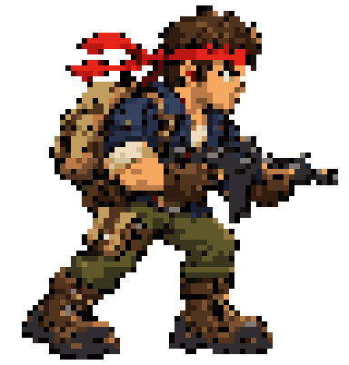

# Agent Skills

Reusable skills for AI coding agents.

[](https://skills.sh/amjadbouhouch/skills)

## Available skills

### pixel-art-toolkit

Create, edit, validate, render, animate, and convert crisp pixel-art assets with an editable text format and a zero-dependency Python tool.

```bash
npx skills add amjadbouhouch/skills --skill pixel-art-toolkit
```

Skill source: [`skills/creative/pixel-art-toolkit`](skills/creative/pixel-art-toolkit)

### agent-board

Build a persistent SQLite-backed data application — dashboard, metrics view, internal tool — by writing SQL migrations and a declarative JSON specification instead of application code.

```bash
npx skills add amjadbouhouch/skills --skill agent-board
```

Skill source: [`skills/data/agent-board`](skills/data/agent-board) · Runtime: [agent-board](https://github.com/amjadbouhouch/agent-board)

## Example

| Detailed sprite | Explosion animation |
|---|---|
| [](skills/creative/pixel-art-toolkit/examples/soldier.png) | [](skills/creative/pixel-art-toolkit/examples/explosion.gif) |
| [`soldier.pix`](skills/creative/pixel-art-toolkit/examples/soldier.pix) | [`explosion.pix`](skills/creative/pixel-art-toolkit/examples/explosion.pix) |

| Coin animation | Shading stages |
|---|---|
| [](skills/creative/pixel-art-toolkit/examples/coin.gif) | [](skills/creative/pixel-art-toolkit/examples/orb_stages.png) |
| [`coin.pix`](skills/creative/pixel-art-toolkit/examples/coin.pix) | [`orb.pix`](skills/creative/pixel-art-toolkit/examples/orb.pix) · [`gen_more.py`](skills/creative/pixel-art-toolkit/examples/gen_more.py) |
