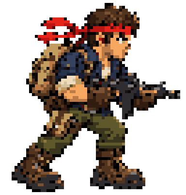
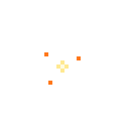
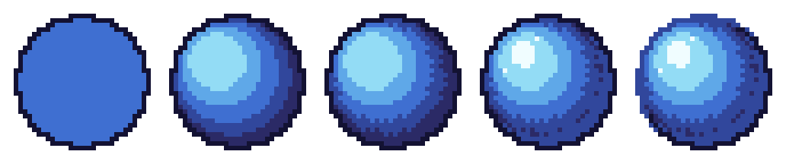

# Agent Skills

Reusable skills for AI coding agents.

[](https://skills.sh/amjadbouhouch/skills)

## Available skills

### pixel-art-toolkit

Create, edit, validate, render, animate, and convert crisp pixel-art assets with an editable text format and a zero-dependency Python tool.

```bash
npx skills add amjadbouhouch/skills --skill pixel-art-toolkit
```

Skill source: [`skills/creative/pixel-art-toolkit`](skills/creative/pixel-art-toolkit)

### agent-board

Build a persistent SQLite-backed data application — dashboard, metrics view, internal tool — with SQL migrations for schema, a declarative JSON specification for the UI, and preview-before-write commands for the data.

```bash
npx skills add amjadbouhouch/skills --skill agent-board
```

Skill source: [`skills/data/agent-board`](skills/data/agent-board) · Runtime: [agent-board](https://github.com/amjadbouhouch/agent-board)

### fleet

Coordinate AI agent sessions (Claude Code, Codex) across machines through a shared Syncthing folder: register, message, hand off context and watch an inbox. The fleet's orchestrator can start new T3 Code sessions, locally or on another machine, that join the fleet and report back.

Install, or update to the latest version:

```bash
npx skills add amjadbouhouch/skills --skill fleet -g -y
```

An existing fleet folder keeps the scripts it was created with. After updating, refresh it with `node ~/.agents/skills/fleet/fleet.mjs init ~/fleet/<topic>`.

Skill source: [`skills/fleet`](skills/fleet)

## Example

| Detailed sprite | Explosion animation |
|---|---|
| [](skills/creative/pixel-art-toolkit/examples/soldier.png) | [](skills/creative/pixel-art-toolkit/examples/explosion.gif) |
| [`soldier.pix`](skills/creative/pixel-art-toolkit/examples/soldier.pix) | [`explosion.pix`](skills/creative/pixel-art-toolkit/examples/explosion.pix) |

| Coin animation | Shading stages |
|---|---|
| [](skills/creative/pixel-art-toolkit/examples/coin.gif) | [](skills/creative/pixel-art-toolkit/examples/orb_stages.png) |
| [`coin.pix`](skills/creative/pixel-art-toolkit/examples/coin.pix) | [`orb.pix`](skills/creative/pixel-art-toolkit/examples/orb.pix) · [`gen_more.py`](skills/creative/pixel-art-toolkit/examples/gen_more.py) |
